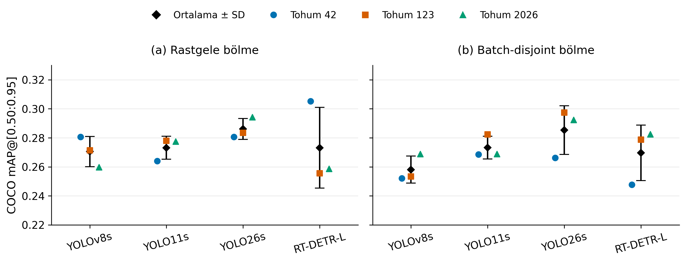
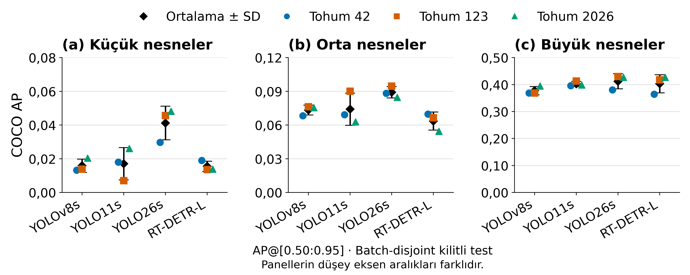

# Sürdürülebilir Atık Yönetiminde Yapay Zekâ Tabanlı Çöp Tespiti: Güvenilirlik ve Küçük Nesne Performansı

[](https://github.com/pedropro/TACO)
[](#deney-düzeni)
[](#deney-düzeni)

TACO veri setinde **YOLOv8s, YOLO11s, YOLO26s ve RT-DETR-L** modellerini karşılaştıran çalışmanın eğitim kodları, veri bölmeleri, deney kayıtları ve analiz dosyaları.

Çalışma, ortalama tespit başarımının yanında **veri bölme protokolünün etkisini, eğitim tohumları arasındaki değişkenliği ve küçük nesnelerdeki hataları** inceler.

> **İlgili makale:** *Sürdürülebilir Atık Yönetiminde Yapay Zekâ Tabanlı Çöp Tespiti: Güvenilirlik ve Küçük Nesne Performansı.*
> Makale hakem değerlendirmesi sonrası revizyon aşamasındadır. Bu depo, çalışmanın kod ve sonuçlarını paylaşmak için hazırlanmıştır.
>
> **English title (translation):** *AI-Based Litter Detection in Sustainable Waste Management: Reliability and Small-Object Performance.*

## İçindekiler

- [Deney düzeni](#deney-düzeni)
- [Ana sonuçlar](#ana-sonuçlar)
- [Şekiller](#şekiller)
- [Depo içeriği](#depo-içeriği)
- [Hızlı başlangıç: GPU olmadan analiz](#hızlı-başlangıç-gpu-olmadan-analiz)
- [Eğitim hattını çalıştırma](#eğitim-hattını-çalıştırma)
- [İstatistiksel analiz ve yorum sınırları](#istatistiksel-analiz-ve-yorum-sınırları)
- [Yeniden üretim kapsamı](#yeniden-üretim-kapsamı)
- [Veri, yazılım ve kullanım koşulları](#veri-yazılım-ve-kullanım-koşulları)
- [Atıf ve iletişim](#atıf-ve-iletişim)

## Deney düzeni

| Özellik | Açıklama |
|---|---|
| Veri | TACO; çalışmada kullanılan alt kümede 1.500 görüntü ve 4.784 nesne |
| Görev | Görüntülerde çöp nesnelerinin tespiti |
| Modeller | YOLOv8s, YOLO11s, YOLO26s, RT-DETR-L |
| Protokoller | Görüntü düzeyinde `random` ve batch grupları ayrık `batch_disjoint` |
| Eğitim tohumları | 42, 123, 2026 |
| Koşu sayısı | 4 model × 2 protokol × 3 tohum = **24 eğitim** |
| Eğitim bütçesi | En fazla 100 epoch; erken durdurma `patience=20` |
| Temel ölçüt | COCO mAP50–95; AP50, AP75 ve nesne boyutuna göre AP/AR kayıtları |
| İşletim noktası | Doğrulama kümesinde belirlenen güven eşikleriyle P/R/F1 ve hata analizi |
| İstatistik | Tohum blokları içinde tam permütasyon testi ve protokol başına Holm düzeltmesi |

### Veri bölmeleri

| Protokol | Eğitim: görüntü / nesne | Doğrulama: görüntü / nesne | Test: görüntü / nesne |
|---|---:|---:|---:|
| Random | 1.050 / 3.284 | 225 / 674 | 225 / 826 |
| Batch-disjoint | 1.061 / 3.369 | 239 / 708 | 200 / 707 |

Random bölmede kaynak batch'leri alt kümeler arasında paylaşılabilir. Batch-disjoint bölmede batch grupları birbirinden ayrılır; 15 batch'in 11'i eğitim, 2'si doğrulama ve 2'si test için kullanılır. Bölmeler `02_splits/` altında kayıtlıdır ve modeller aynı protokolün aynı bölmesi üzerinde değerlendirilir.

**Tohumlar yeni veri bölmeleri değildir.** Her protokolde tek sabit veri bölmesi üzerinde üç eğitim gerçekleştirilmiştir.

## Ana sonuçlar

Aşağıdaki değerler, `locked_test_summary_all_runs.csv` dosyasındaki üç eğitim koşusunun **ortalama ± örnek standart sapma** değerleridir. mAP, 0–1 ölçeğinde verilmiştir.

| Model | Random mAP50–95 | Batch-disjoint mAP50–95 |
|---|---:|---:|
| YOLOv8s | 0,2705 ± 0,0104 | 0,2581 ± 0,0093 |
| YOLO11s | 0,2731 ± 0,0079 | 0,2732 ± 0,0079 |
| YOLO26s | **0,2861 ± 0,0072** | **0,2853 ± 0,0168** |
| RT-DETR-L | 0,2732 ± 0,0278 | 0,2696 ± 0,0191 |

- YOLO26s her iki protokolde en yüksek **gözlenen ortalama** mAP50–95 değerini vermiştir. Bu sıralama istatistiksel üstünlük kanıtı değildir.
- RT-DETR-L, batch-disjoint protokolünde 53, 21 ve 21 epoch tamamlamıştır. Erken durdurma, daha uzun eğitim altındaki performansını değerlendirmeyi sınırlar; bu kayıtlar tek başına yakınsamama kanıtı oluşturmaz.
- Modellerin parametre ve hesaplama maliyetleri farklıdır. Bu deney, eşit parametre veya eşit hesaplama bütçesinde bir mimari karşılaştırması değildir.
- Küçük nesnelerde, incelenen işletim noktalarında yanlış-negatif oranları yaklaşık **%93,89–100** aralığındadır. Bu oranlar boyuta göre AP ile aynı ölçüt değildir; saha kullanımında küçük çöplerin kaçırılması önemli bir sınırdır.

## Şekiller

### Genel tespit başarımı



Her işaret bir eğitim tohumunu; siyah elmas ve hata çubuğu ortalama ± standart sapmayı gösterir. İki panel aynı düşey ekseni kullanır; eksen sıfırdan başlamaz. [Vektörel PDF](Sekil_1.pdf).

### Nesne boyutuna göre başarım



COCO boyut sınıflarına göre AP değerleri. Panellerin düşey eksen aralıkları farklıdır: küçük 0–0,08; orta 0–0,12; büyük 0–0,50. [Vektörel PDF](Sekil_2.pdf).

## Depo içeriği

| Dosya / klasör | İçerik |
|---|---|
| `reproduce_mAP_and_figures.py` | Mevcut koşu sonuçlarından mAP testlerini ve Şekil 1–2'yi üretir |
| `requirements-analysis.txt` | GPU gerektirmeyen analiz bağımlılıkları |
| `locked_test_summary_all_runs.csv` | 24 koşunun sabit test bölmelerindeki sonuçları |
| `mAP_exact_tests.csv` | Tam permütasyon testleri, Holm düzeltmesi ve bağımsız grup duyarlılık analizi |
| `TACO_Atik14082026_FULL_FIXED_v5.ipynb` | Özgün Colab eğitim ve değerlendirme hattı |
| `archive/TACO_TR_Renkli_Sekiller_Frozen_Data_Pipeline.ipynb` | Tarihsel görselleştirme not defteri; son şekiller için kullanılmaz |
| `02_splits/` | Bölme manifestleri, batch atamaları ve bölme özeti |
| `08_metadata/` | Kaynak anotasyonların çalışma için kullanılan kayıtları |
| `10_reviewer_sensitivity/` | Eğitim ayrıntıları, değerlendirme ayarları, bölme ve model karmaşıklığı kayıtları |
| `bootstrap_model_global_f1_ci.csv` | Mevcut F1 bootstrap güven aralığı sonuçları |
| `bootstrap_pairwise_global_f1_differences.csv` | Mevcut ikili F1 bootstrap karşılaştırmaları |
| `locked_test_error_taxonomy_mean_sd.csv` | Hata türlerine ilişkin ortalama ve standart sapmalar |
| `Sekil_1.png/pdf`, `Sekil_2.png/pdf` | Revizyonda kullanılan şekiller; PNG ve vektörel PDF |

Not defterlerinin yürütme çıktıları dosya boyutunu azaltmak için temizlenmiştir; kod hücreleri korunmuştur. F1 bootstrap CSV'leri mevcut deney çıktılarıdır; aşağıdaki hızlı başlangıç betiği bunları yeniden hesaplamaz.

## Hızlı başlangıç: GPU olmadan analiz

Depodaki CSV'den yeni mAP analizini ve iki şekli üretmek için kaynak görüntü veya model ağırlığı gerekmez.

```bash
git clone https://github.com/gokhanturan/ai-litter-detection-reliability.git
cd ai-litter-detection-reliability
python -m venv .venv
```

Ortamı etkinleştirin:

```bash
# Windows (PowerShell)
.venv\Scripts\Activate.ps1

# Linux / macOS
source .venv/bin/activate
```

Bağımlılıkları kurup analizi çalıştırın:

```bash
python -m pip install -r requirements-analysis.txt
python reproduce_mAP_and_figures.py --out reproduced
```

Farklı bir sonuç tablosu kullanmak için:

```bash
python reproduce_mAP_and_figures.py --input locked_test_summary_all_runs.csv --out reproduced
```

`reproduced/` klasöründe `mAP_exact_tests.csv`, `Sekil_1.png`, `Sekil_1.pdf`, `Sekil_2.png` ve `Sekil_2.pdf` oluşur. Betik sonuç tablosunun koşu düzeyindeki metriklerini kullanır; görüntü düzeyindeki COCO değerlendirmesini yeniden çalıştırmaz.

## Eğitim hattını çalıştırma

1. Google Colab'da `TACO_Atik14082026_FULL_FIXED_v5.ipynb` dosyasını açın ve GPU çalışma zamanı seçin.
2. Drive bağlantısını ve `BASE` çalışma dizinini kendi ortamınıza göre düzenleyin.
3. Hücreleri aşama sırasıyla çalıştırın. Defter, bağımlılık kurulumu, TACO kaynaklarının indirilmesi, veri hazırlama, bölme, eğitim, doğrulama ve sabit test değerlendirmesi kodlarını içerir.
4. Çalışmadaki bölmeleri korumak istiyorsanız `02_splits/` manifestlerini esas alın; yeniden üretilen bölmeleri bu kayıtlarla karşılaştırın.

Eğitim defteri `ultralytics==8.4.111` sürümünü belirtir ve kendi kurulum hücresini içerir. `requirements-analysis.txt` yalnızca hızlı analiz içindir; eğitim ortamının tam bağımlılık listesi değildir. Eğitim GPU, kaynak görüntüler ve uygun çalışma dizinleri gerektirir. Arşivdeki özgün görselleştirme defteri ayrıca deney hattının çıktı klasörlerine ihtiyaç duyar ve son şekillerin üretim betiği değildir.

## İstatistiksel analiz ve yorum sınırları

Her protokolde altı model çifti karşılaştırılır. Aynı tohum numaraları **blok** olarak eşleştirilir; sıfır hipotezi altında model etiketlerinin blok içinde değiştirilebilir olduğu varsayılır. Test istatistiği ortalama mAP farkıdır.

- Üç blok için **2³ = 8** etiket değişimi tam olarak değerlendirilir.
- İki yönlü testte ulaşılabilen en küçük ham p-değeri **0,25**'tir. Bu tasarım `α=0,05` düzeyinde anlamlı bir fark gösteremez.
- Çoklu karşılaştırmalar protokol başına altı test içinde **Holm** yöntemiyle düzeltilir; mevcut sonuçlarda düzeltilmiş p-değerlerinin tamamı 1,00'dır.
- Aynı tohum numarası farklı mimarilerde aynı rastgele süreci garanti etmez. Bu nedenle 20 olası bağımsız grup atamasıyla tam permütasyon duyarlılık analizi de CSV'de verilir.
- Farkın anlamlı çıkmaması **modellerin eşdeğer olduğu anlamına gelmez**. Daha güçlü çıkarım için ek bağımsız eğitim koşuları gerekir.

Bu analizler sabit test bölmelerine koşulludur. Tek batch-disjoint bölmesi, TACO dışı veri veya gerçek saha başarımı için genelleme kanıtı sağlamaz. Revizyon analizinde yeni eğitim, çıkarım, güven eşiği seçimi veya veri bölmesi yapılmamıştır.

## Yeniden üretim kapsamı

| İşlem | Yalnızca bu depoyla yapılabilir mi? | Ek gereksinim |
|---|---|---|
| Yeni mAP p-değerleri ve Şekil 1–2 | **Evet** | Analiz bağımlılıkları |
| Koşu düzeyinde sonuçları ve bölme manifestlerini inceleme | **Evet** | CSV/JSON okuyucu |
| Görüntü düzeyinde AP veya F1 bootstrap hesaplarını yeniden yürütme | **Hayır** | Tüm tahminler, ilgili anotasyonlar ve değerlendirme ortamı |
| Özgün eğitilmiş modellerle çıkarım | **Hayır** | Eğitilmiş checkpoint'ler ve kaynak görüntüler |
| Eğitim hattını yeniden çalıştırma | **Ek kaynaklarla** | TACO görüntüleri, GPU, bağımlılıklar ve dizin ayarları |

Depoda **TACO görüntüleri, tüm tahmin JSON'ları ve eğitilmiş checkpoint ağırlıkları bulunmaz**. Yeni eğitimden elde edilen sonuçların donanım, yazılım ortamı ve rastgelelik nedeniyle birebir aynı olması garanti edilmez.

## Veri, yazılım ve kullanım koşulları

- **Kaynak veri:** [TACO resmî deposu](https://github.com/pedropro/TACO) ve eğitim defterinde kullanılan [Zenodo arşivi](https://zenodo.org/records/3587843). Görüntüler ve anotasyonlar için kaynakların kullanım koşulları geçerlidir.
- **Eğitim ve değerlendirme:** Ultralytics ve COCO değerlendirme araçları kullanılır. Üçüncü taraf yazılımların kendi lisansları geçerliliğini korur.
- Bu paket yeni bir kod lisansı atamaz. Kalıcı `LICENSE` dosyası eklenene kadar bu depodaki özgün kod için ayrıca bir açık kaynak lisansı beyan edilmemiştir; herkese açık erişim, tek başına lisans izni anlamına gelmez.

## Atıf ve iletişim

Makalenin yayın künyesi veya DOI'si kesinleştiğinde bu bölüm güncellenecektir. Şimdilik kod ve sonuç deposuna atıf vermek için:

```bibtex
@misc{turan2026litterreliability,
  author = {Turan, Gökhan},
  title  = {Sürdürülebilir Atık Yönetiminde Yapay Zekâ Tabanlı Çöp Tespiti: Güvenilirlik ve Küçük Nesne Performansı},
  year   = {2026},
  note   = {Kod ve deney sonuçları deposu},
  url    = {https://github.com/gokhanturan/ai-litter-detection-reliability}
}
```

**Gökhan TURAN** · [GitHub](https://github.com/gokhanturan) · [Sorular ve hata bildirimleri](https://github.com/gokhanturan/ai-litter-detection-reliability/issues)

## Son makaleyle eşleştirme

Paket 1 Ekim 2026 tarihinde son revizyonla eşleştirilmiştir. Bölüm 2.8'deki erişilebilirlik beyanı, dosyalar GitHub'a yüklenene kadar “paylaşım için hazırlanmıştır” biçimindedir. Bu paket kendiliğinden GitHub'a yüklenmez.

- Ek istatistik tablosunun adı **Ek Tablo S1**'dir; S6 adı bu yeni mAP analizi için kullanılmaz.
- `10_reviewer_sensitivity/Run_Training_Details_Final.csv`, koşu eğitim ayrıntılarının son tablosudur. Arşivdeki geçici stage10b dosyasının hash arama alanı, stage10c denetiminde 24/24 doğrulanmıştır. Son tablo hash eşleşmesine dayanır; eğitim veya metrikler değiştirilmemiştir.
- `07_manifests/` dondurulmuş eğitim yapılandırmasını, eşikleri, bölme ve checkpoint kayıtlarını içerir. Bunlar deney sırasında kullanılan özgün ortam yollarını belgeleyebilir; mevcut depo içinde aynı yolların var olduğunu iddia etmez.
- Aynı sahneyi gösteren yakın kopyanın post-hoc sonuçları `10_reviewer_sensitivity/` altında bulunur. Bu işlem yeni eğitim veya çıkarım içermez.
- `manuscript_tables/` son makaledeki Tablo 1–7 ve Ek Tablo S1'in metinsel CSV aktarımını içerir.
- `verify_consistency.py` 24 koşuyu, tohumları, son hash tablosunu, ana metrikleri ve paket dosya hash'lerini kontrol eder.

```bash
python verify_consistency.py
```

Şekil 3 ve Şekil 4, son makaledeki nitel ve yakın kopya inceleme görselleridir (`Sekil_3.jpg`, `Sekil_4.jpg`). Kaynak TACO görüntü koleksiyonu dağıtılmaz; bu görsellerin kaynak veri kullanım koşulları korunur. Paket tüm görüntü düzeyi bootstrap veya özgün COCO değerlendirmesini tek başına yeniden üretmez.
